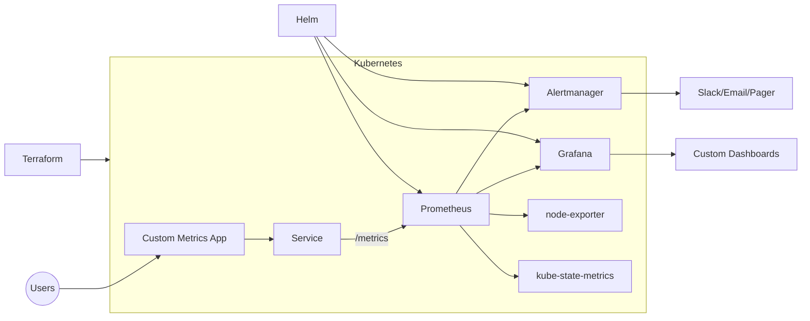
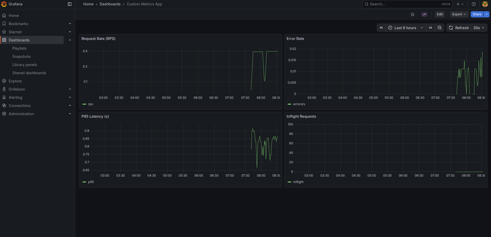
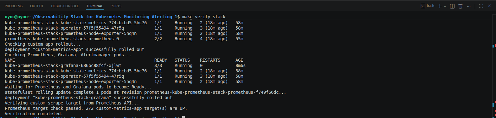

# Kubernetes Observability Stack

A practical observability project I built to monitor a Kubernetes app end-to-end.

It uses:
- Terraform (cluster infra)
- Helm + kube-prometheus-stack
- Prometheus + Grafana + Alert rules
- A small custom metrics app

## Architecture



## What I actually validated

- custom app metrics are scraped by Prometheus (`custom-metrics-app` targets are `UP`)
- dashboards render live app metrics in Grafana
- automated verification script passes (`make verify-stack`)

## Proof

### Prometheus target health


### Grafana custom metrics dashboard


### Verification run


## How to run

```bash
make preflight
make deploy-stack APP_IMAGE="$APP_IMAGE"
make verify-stack
```

For local demo without AWS, I also ran this on a `kind` cluster.

## Notes

- evidence logs are in `docs/evidence/`
- dashboards are in `grafana-dashboards/`
- this repo includes fixes made during testing (dashboard import + verify script reliability)
