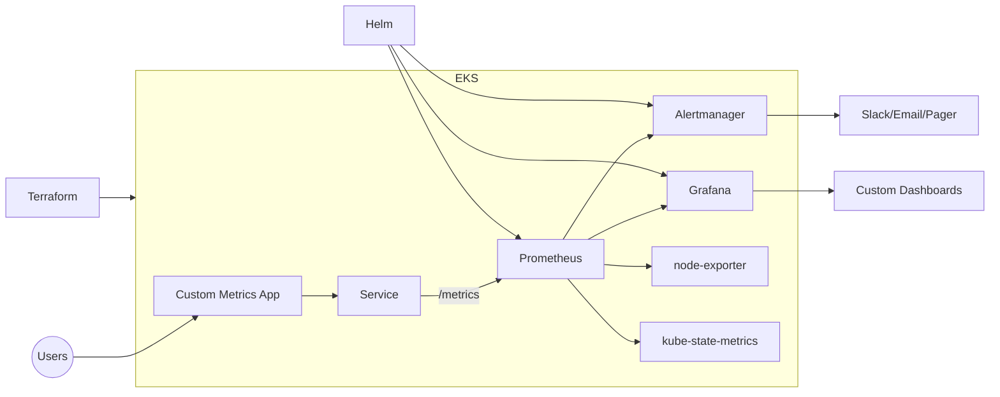

# Architecture

```mermaid
flowchart LR
  users((Users)) --> app[Custom Metrics App]
  app --> svc[Service]
  svc -->|/metrics| prom[Prometheus]
  prom --> am[Alertmanager]
  prom --> graf[Grafana]
  prom --> ne[node-exporter]
  prom --> ksm[kube-state-metrics]
  am --> notify[Slack/Email/Pager]
  graf --> dashboards[Custom Dashboards]

  subgraph EKS
    app
    svc
    prom
    am
    graf
    ne
    ksm
  end

  terraform[Terraform] --> EKS
  helm[Helm] --> prom
  helm --> graf
  helm --> am
```
